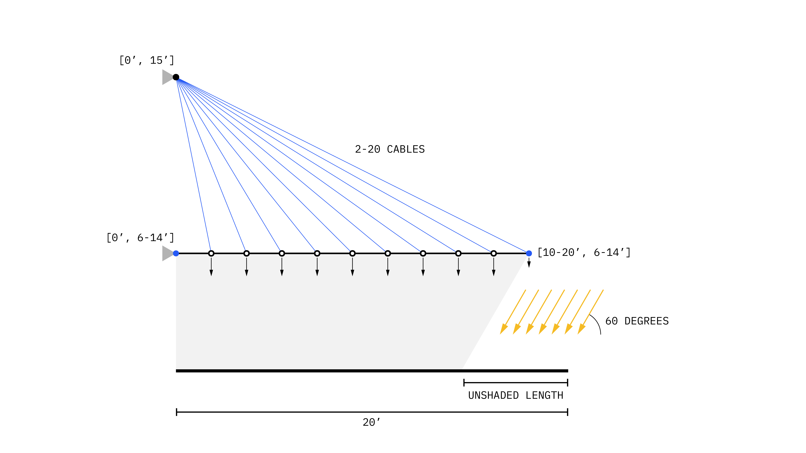
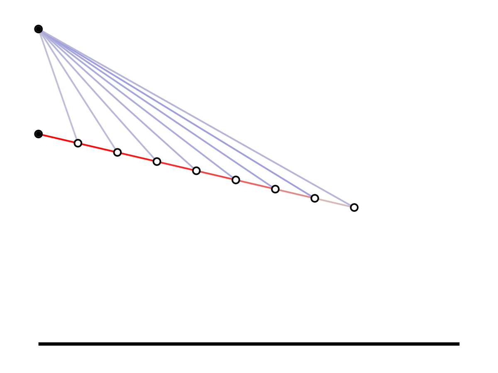
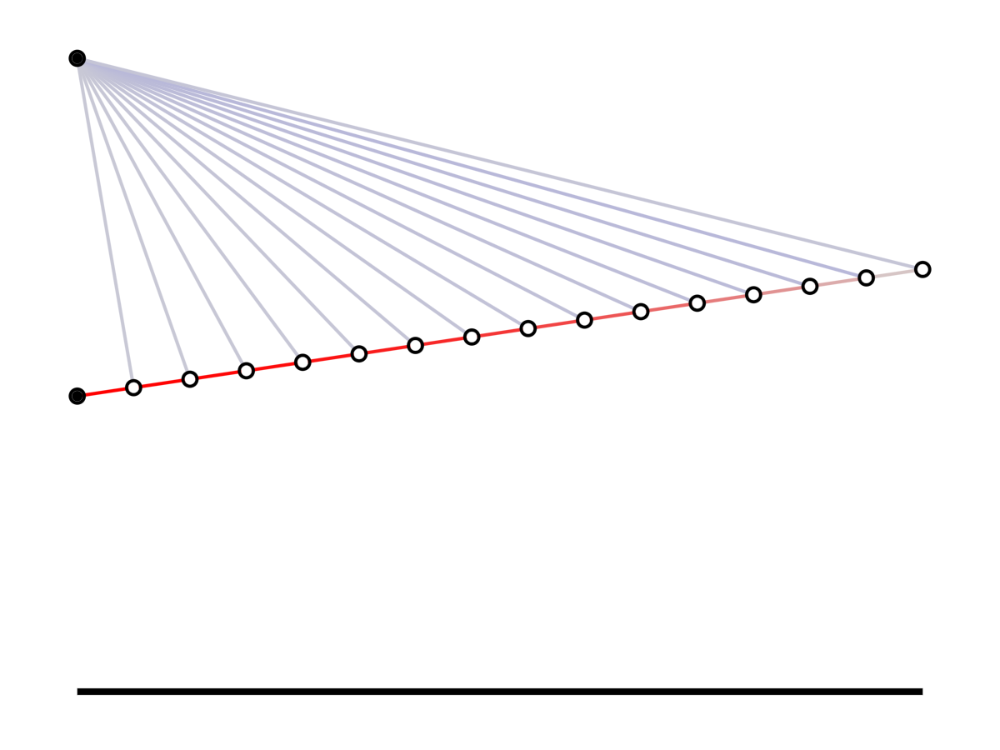
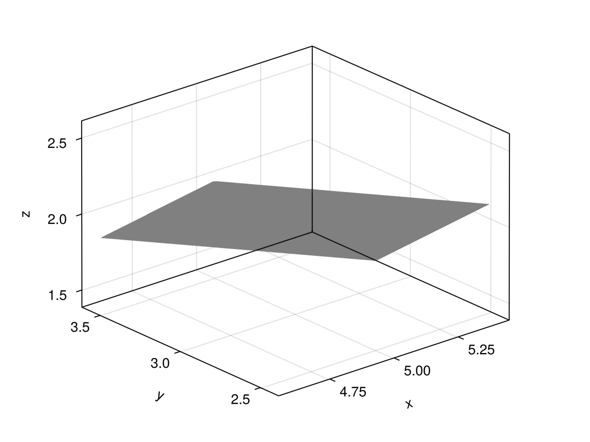
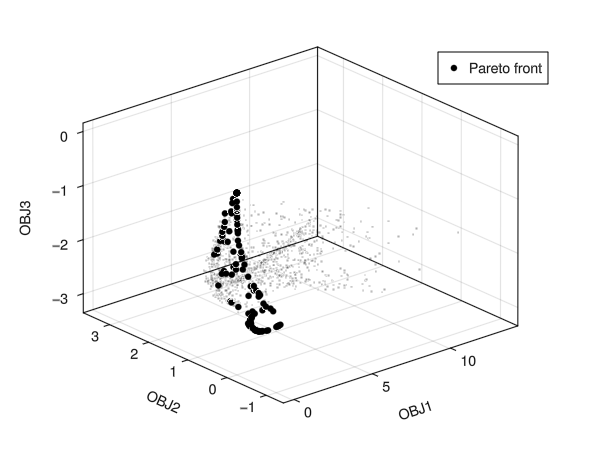
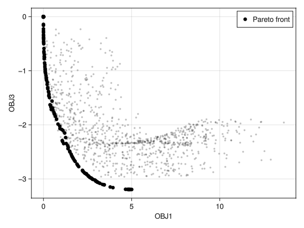

# 1.575J/4.450J/4.451 Homework 05 // Multi-Objective Exploration
Like Homework 1, this problem asks you to consider multiple criteria in exploring the design space, but in this case, you will use multiple quantitative objective functions. The multi-objective design problem to be investigated is shown below; a cable-stayed canopy is needed to shade a 20’-long patio. 



This repository provides a framework for those looking to approach this assignment in Julia.

# Usage
## Installing Julia
Download and install Julia either through their [website](https://julialang.org/) or using [juliaup](https://github.com/JuliaLang/juliaup).
- If you have intentions of using/learning Julia long-term, we recommend the use of juliaup as it enables multiple versions to be installed over time for better compatibility with older projects.

For those on Windows, you should add Julia to your PATH.

## Cloning this repository
Using git or simply downloading a .zip file of all the code, save this environment somewhere on your computer.


## Instantiating the environment
The `Project.toml` file contains a record of all the external packages and versions that were used to generate this code. To download and install these dependencies, first navigate to the folder you downloaded in VS Code and open a Julia REPL. You can do this by:
1. Enter command mode in VS Code by typing `ctrl+shift+p` and searching for `Julia: Start REPL`
2. Typing `alt+j, alt+o`

Then enter package mode in the REPL by typing `]` and entering `instantiate`:
```julia-repl
(HW05_4451) pkg> instantiate
```

You will only need to do this once.

# Tips for Homework 05
## Generating and visualizing structures
`generate_canopy` has been provided for you to generate a structural canopy model using `Asap.jl`. Take a look in `src/Canopy.jl` to see how this was done. This takes in the four design variables as outlined in the Homework, either as individual arguments or as a vector, e.g.:

```julia
x1 = 10 # vertical position of support
x2 = 15 # horizontal position of tip
x3 = 6.5 # vertical position of tip
x4 = 8 # number of cables

model = generate_canopy(x1, x2, x3, x4)
```

Use `visualize_2d` to visualize this structure:
```julia
visualize_2d(model)
```



Or equivalently:
```julia
x = [7, 20, 10, 15]
model = generate_canopy(x)
visualize_2d(model)
```




### Customizing your visualization
Do you not want to color the elements by their force? Is the black at the bottom too thick/distracting? Take a look inside `src/Visualization.jl` to change the function how you see fit!

All visualization is done using [Makie.jl](https://docs.makie.org/v0.21/). Take a look at their documentation to apply what you want. For example, Once you figure out `J2`, you may want to use a version of it to visualize the shaded region under your canopy!

## Objective functions
Before you begin the homework assignment, you will need to define the three objective functions for this problem. A template is provided for you in `objectives.jl`.

Here, fill in the missing gaps that define J1, J2, and J3. These functions will take in a canopy structural model and return the required quantitative score. Some tips:

1. `node_positions(model::TrussModel)` will give you a \[n_elements x 3\] matrix of the X, Y, Z positions of all nodes in a given model
2. `model.nodes[id]` will extract the nodes with a given identifier. E.g. if a node is given the id `:group1` you can pull out all the nodes with that id via: `model.nodes[:group1]`. Take a look inside `src/Canopy.jl` to see what ids have been assigned to the nodes.
3. `axial_force(element::TrussElement)` is a predefined function to get the axial force of a structural element. You can use the dot operator to apply this to a collection of elements: `axial_force.(model.elements)`
4. The `length` function has been extended to measure the length of a structural element: `length(element::TrussElement)`. You can also broadcast this to a collection of elements.

Once your functions are defined, you will be able to use `composite_objective` in part A and `multiple_objective` in part B.

## Sampling
As in [Homework 04](https://github.com/keithjlee/HW04_4451), we have provided sampling functions for you to test many values of your design space (in this case, a 4-dimensional design space). You may find this useful when you are looking to find a suitable normalizer in your composite objective. Below is a quick example of a random sampling:

```julia
n_samples = 1000

# bounds
x1bounds = (6,14)
x2bounds = (10,20)
x3bounds = (6,14)
x4bounds = (2,20)
bounds = [x1bounds, x2bounds, x3bounds, x4bounds]

# make random samples
x_samples = random_sampler(n_samples, 4, bounds)

# make canopies from your random samples
models = generate_canopy.(x_samples)

#get individual objective values for each sampled model
j1s = J1.(models)
j2s = J2.(models)
j3s = J3.(models)

#visualize
fig = Figure()
ax = Axis3(
    fig[1,1],
    xlabel = "J1",
    ylabel = "J2",
    zlabel = "J3"
)

scatter!(j1s, j2s, j3s, color = :green)

display(fig)

```

## Optimization using `Nonconvex.jl` and `NonconvexNLopt.jl`
Note that since we are using a non-continuous variable (the number of cables), gradient-based optimization is not applicable, and we cannot benefit from `AsapOptim.jl`. Rather, we will ask you to use common Julia optimization libraries directly.

Assuming you have defined objective functions J1-J3, here is an example of an optimization performed on a composite objective function:

```julia
#load optimization libraries
using Nonconvex, NonconvexNLopt

x1 = 10
x2 = 20
x3 = 10
x4 = 8

# design vector
x0 = [x1, x3, x3, x4]

# define bounds
lower_bounds = [6, 10, 6, 2]
upper_bounds = [14, 20, 14, 20]

# composite weights (which should include your normalization strategy)
f1 = 0.02
f2 = 0.5
f3 = 2.5

# make a closure for your single-argument objective
OBJ = x -> composite_objective(x, f1, f2, f3)

# now this is a single-argument function, e.g.:
o0 = OBJ(x0) #same as composite_objective(x0, f1, f2, f3)

# make an optimization model
optimization_model = Nonconvex.Model(OBJ)

# define variables
addvar!(optimization_model, lower_bounds, upper_bounds)

# define your optimization algorithm
optimization_algorithm = NLoptAlg(:LN_BOBYQA)

# optimize (optimization model, algorithm, starting values)
optimization_results = Nonconvex.optimize(optimization_model, optimization_algorithm, x0)

# extract results
optimized_x = optimization_results.minimizer
optimized_obj = optimization_results.minimum
```

For different available algorithms in `NonconvexNLopt`, see [here](https://julianonconvex.github.io/Nonconvex.jl/stable/algorithms/nlopt/).

## Visualizing a plane using Makie.jl
In A.3, we ask you to plot planes that represent the isosurface regions of a given composite weight. There is no built-in function to define this, so we have made `make_plane_mesh` for you that returns a mesh object. Here is an example:

```julia
#define a plane origin
origin = [5, 3, 2]

#define a normal vector for the plane
normal = [1, 1, 1]

#define plane width
b = 0.5

# define plane height
h = 0.5

#make a plane
plane = make_plane_mesh(origin, normal, b, h)

#make a figure
fig = Figure()

#make a 3D axis inside the figure
ax = Axis3(fig[1,1])

#visualize the plane
mesh!(plane, color = (:black, 0.5)) # (:black, 0.5) gives a transparency of 0.5 to the color black

display(fig)

```



## Multiobjective optimization using Metaheuristics.jl
In part B, we ask you to perform multi-objective optimization using the NSGA-II algorithm. Below is an example of how to use `NSGA2` in `Metaheuristics.jl` to perform multi objective optimization.

### Define objective
```julia
using Metaheuristics

#some random multiobjective function
function multi_obj(x)
    objective_1 = sum(x.^2) #square each item in x and sum them together
    objective_2 = sqrt(abs(x[2])) - x[1] * x[3] #square root of the second value and subtract the product of the first and third values
    objective_3 = -norm(sin.(x) .+ sqrt.((abs.(x)))) #take the negative of the L2-norm of the sin of each value plus the square root of the absolute values

    #collect your objectives
    objectives = [objective_1, objective_2, objective_3]

    #for Metaheuristics.jl, you need to output constraints as well, even if you don't have any. Since we have no constraints, we just output a vector of 0
    inequality_constraints = [0.0]
    equality_constraints = [0.0]

    return (objectives, inequality_constraints, equality_constraints)
end
```

### Perform some sampling
This part is not strictly needed, but will be useful for visualization
```julia
#bounds
x1min, x1max = -1.0, 1.0
x2min, x2max = 0.0, 3.0
x3min, x3max = -2.0, 0.5

#try sampling to visualize the design space
sampling_bounds = [(x1min, x1max), (x2min, x2max), (x3min, x3max)]
samples = random_sampler(1000, 3, sampling_bounds)

#take the objective function results for your samples
sampled_objectives = [multi_obj(sample)[1] for sample in samples]
```

### Perform optimization
```julia
#Metaheuristics.jl requires bounds to be defined as a [2 x n_variables] matrix
optimization_bounds = [
    x1min x2min x3min;
    x1max x2max x3max
]

optimization_algorithm = NSGA2(N = 250) #NSGA2 with a population size of 250

optimization_results = Metaheuristics.optimize(multi_obj, optimization_bounds, optimization_algorithm)
```

### Post process and visualize
```julia
#extract the pareto front
pareto = pareto_front(optimization_results) #a [npopulation x nobjectives] matrix of the points that make up the pareto front

#visualize
sampled_points = [Point3(sample) for sample in sampled_objectives] #we use the Point3 data structure in Makie instead of pulling on individual x,y,z components

optimal_points = Point3.(eachrow(pareto)) #equivalent to a for loop that loops over each row of `pareto` and turning it into a Point3

fig = Figure()
ax = Axis3(
    fig[1,1],
    xlabel = "OBJ1",
    ylabel = "OBJ2",
    zlabel = "OBJ3"
)

scatter!(sampled_points, markersize = 5, color = (:black, 0.25))
scatter!(optimal_points, markersize = 5, color = :black, label = "Pareto front")

axislegend(ax)

fig
```



### Biobjective plotting
```julia
#pull just obj1 and 3 from the sampled dataset
obj1_sampled = [sample[1] for sample in sampled_objectives]
obj3_sampled = [sample[3] for sample in sampled_objectives]

#pull obj1 and 3 from the optimized population
obj1_optimal = pareto[:, 1] #this pulls all rows from the first column
obj3_optimal = pareto[:, 3]

fig = Figure()
ax = Axis(
    fig[1,1],
    xlabel = "OBJ1",
    ylabel = "OBJ3"
)

scatter!(obj1_sampled, obj3_sampled, markersize = 5, color = (:black, 0.25))
scatter!(obj1_optimal, obj3_optimal, markersize = 10, color = :black, label = "Pareto front")

axislegend(ax)

fig
```

